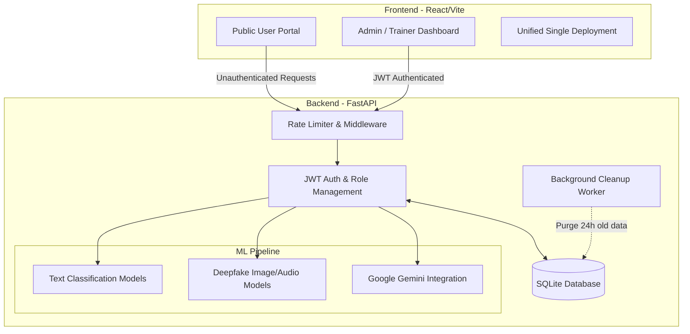

<div align="center">
  <a href="https://legitai-app.vercel.app/" target="_blank">
    
  </a>
  
  
  
  <h1>🛡️ Legit.ai</h1>
  <p><b>Advanced AI-Powered Misinformation & Deepfake Detection Platform</b></p>
</div>

---

## 📖 Overview

Legit.ai is a privacy-first, fully-featured platform designed to detect potentially misleading text, images, and audio using a **hybrid Machine Learning stack**. 

🌍 **Try the Live Demo here: [https://legitai-app.vercel.app/](https://legitai-app.vercel.app/)**

It provides a seamless, "iLovePDF-style" public detection portal for users, and a deeply secured JWT-authenticated dashboard for Admins and AI Trainers to manage the system and track metrics.

## ✨ Key Features

- **🌐 Browser-Isolated Sessions:** Public users can scan content anonymously without an account. All histories are tied to local browser sessions.
- **🧹 24-Hour Auto-Scrubbing:** Privacy is prioritized. A background worker securely deletes all scanned records older than 24 hours.
- **🤖 Ensemble ML Pipeline:** Utilizes offline Hugging Face classifiers for text, zero-shot categorizations, and deepfake image detection.
- **🧠 LLM Explainer:** Integrates with Google Gemini (optional) to provide human-readable explanations for *why* content was flagged as misinformation.
- **🔒 Secure Admin/Trainer Portal:** Fully protected backend routes with JWT (JSON Web Tokens), role-based access control, and hashed passwords via `passlib`.
- **⚡ GPU Acceleration:** Automatically detects and utilizes CUDA-compatible GPUs for rapid model inference, falling back to CPU gracefully.

---
## 🏗️ Architecture Flowchart



---

## 🚀 Tech Stack

- **Backend:** Python 3.10+, FastAPI, Uvicorn, SQLAlchemy, Celery
- **Machine Learning:** PyTorch (CUDA supported), Transformers, Hugging Face `pipeline`
- **Frontend:** React, Vite, TypeScript, Tailwind CSS, shadcn-ui, React Router
- **Security:** bcrypt password hashing, HTTPOnly JWT Tokens

---

## 💻 Getting Started

### 1. Backend (API) Setup

```sh
cd api
python -m venv venv
# Windows: venv\Scripts\activate
# Linux/Mac: source venv/bin/activate
pip install -r requirements.txt
```

**Configure Environment:**
Copy the template and fill in optional API keys:
```sh
cp .env.example .env
```
*(Note: Never commit your `.env` file to version control. The `.gitignore` is already configured to hide it).*

**Start the Server:**
```sh
python -m uvicorn main:app --port 8000
```
- API is available at: [http://127.0.0.1:8000](http://127.0.0.1:8000)
- Swagger Docs: [http://127.0.0.1:8000/docs](http://127.0.0.1:8000/docs)

*The first request may be slow as the system downloads the required Hugging Face model weights.*

### 2. Frontend Setup (Public & Admin Portals)

The public portal and the admin dashboard are unified into a single React application for easy deployment.

```sh
cd frontend
npm install
npm run dev -- --port 3000
```
- **Public UI is available at:** [http://localhost:3000](http://localhost:3000)
- **Admin Portal is available at:** [http://localhost:3000/admin-site/login](http://localhost:3000/admin-site/login)

*(On first backend startup, a default admin account is automatically provisioned. Username: `admin`, Password: `adminpass`. It is highly recommended to change this in production).*

---

## ☁️ Deployment

Legit.ai is currently deployed and live at: **[legitai-app.vercel.app](https://legitai-app.vercel.app/)**

If you want to host your own instance, Legit.ai can be deployed completely for free! 
- **Backend**: Deploy the `huggingfaceuploads/` folder to a **Hugging Face Docker Space** (gives 16GB RAM for ML models).
- **Frontend**: Deploy the `frontend/` folder to **Vercel**.
*(Detailed deployment instructions are available in `deployment_guide.md`).*
---

## ⚙️ Environment Variables (`api/.env`)

| Variable | Description |
|----------|-------------|
| `GEMINI_API_KEY` | Google Gemini API Key for human-readable explanations (optional) |
| `HF_TOKEN` | Hugging Face token for gated models (optional) |
| `USE_LLM` | `true` / `false` — enable Gemini explanations |
| `EAGER_LOAD_MODELS` | `true` to load ML models immediately on server startup |
| `MODEL_TEXT` | HF text model string (default: bert-tiny fake news) |
| `CACHE_ENABLED` | `true` to cache identical analysis requests |
| `RATE_LIMIT_PER_MINUTE` | Per-IP rate limiting integer |

---

## 🔒 Security & Privacy Notes

- **Credentials:** Default admin credentials are automatically created but should be altered immediately.
- **Git Hooks:** All `.env`, `*.pem`, `*.key`, and SQLite `*.db` files are strictly ignored by Git to prevent accidental credential leakage.

## 📄 License
MIT License
