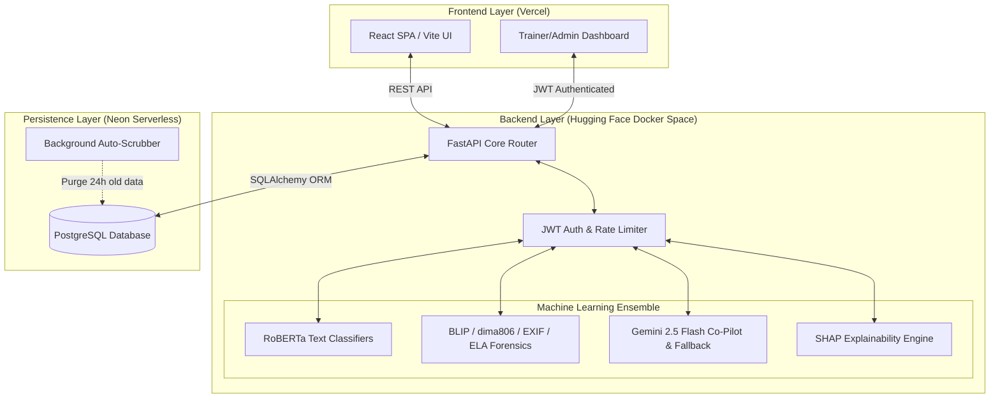

<div align="center">
  <a href="https://legitai-app.vercel.app/" target="_blank">
    
  </a>
  
  
  <br/>
  <br/>
  <h1>🛡️ Legit.ai</h1>
  <p><b>Advanced AI-Powered Misinformation & Deepfake Detection Platform</b></p>
  <br/>
  <p>
    🌍 <a href="https://legitai-app.vercel.app/"><b>Live Detection Portal</b></a> &nbsp; | &nbsp; 
    🔐 <a href="https://legitai-app.vercel.app/admin-site/login"><b>Admin Dashboard</b></a>
  </p>
</div>

---

## 📖 Overview

Legit.ai is a privacy-first, fully-featured platform designed to detect potentially misleading text, images, audio, and video using a **hybrid Machine Learning stack**. 

It provides a seamless, cinematic public detection portal with deepfake analysis for users, alongside a highly secured JWT-authenticated dashboard for Admins and AI Trainers to manage the system and track telemetry.

---

## ✨ Key Features

- **🌐 Browser-Isolated Sessions:** Public users can scan content anonymously without an account. All histories are tied to local browser sessions.
- **🧹 24-Hour Auto-Scrubbing:** Privacy is prioritized. A background worker securely deletes all scanned records older than 24 hours from the database.
- **🤖 Ensemble ML Pipeline:** Utilizes offline Hugging Face classifiers for text (`roberta-base-openai-detector`), zero-shot categorizations, and deepfake image detection (using `BLIP` and `dima806` face detection).
- **🕵️ Deep Forensic Image Analysis:** Employs advanced algorithmic techniques like EXIF metadata anomaly detection and Error Level Analysis (ELA) to catch spliced or heavily photoshopped images before they even hit the AI models.
- **🧠 Gemini 2.5 Flash Co-Pilot & Fallback:** Integrates with Google Gemini to strictly fact-check historical/scientific claims, acting as a Co-pilot to augment local ML classifiers, and gracefully falling back to handle full analysis if local models experience cloud memory limits.
- **🔍 SHAP Explainability Engine:** Powered by SHAP (SHapley Additive exPlanations), providing users with transparent, token-level insights into exactly *why* the AI flagged specific words or phrases.
- **🗄️ Serverless PostgreSQL:** Powered by NeonDB to ensure robust, persistent data storage that easily survives server restarts.
- **⚡ GPU Acceleration:** Automatically detects and utilizes CUDA-compatible GPUs for rapid model inference, falling back to CPU gracefully.

---

## 🏗️ Architecture & Deployment Topology

To maximize performance while remaining completely free to host, Legit.ai splits its architecture across three cloud providers:



### 🗄️ The Database (Neon PostgreSQL)
Initially built on SQLite, Legit.ai was upgraded to a remote **Neon Serverless PostgreSQL** database. Because Hugging Face Spaces can occasionally shut down or restart (wiping local filesystem states), connecting to a remote Neon database ensures that all analytics, tenant records, and detection histories remain completely permanent and resilient.

---

## 🚀 Tech Stack

- **Backend:** Python 3.10+, FastAPI, Uvicorn, SQLAlchemy, psycopg2-binary
- **Machine Learning:** PyTorch (CUDA supported), Transformers, Hugging Face `pipeline`
- **Frontend:** React, Vite, TypeScript, Tailwind CSS, shadcn-ui, Framer Motion
- **Security:** bcrypt password hashing, HTTPOnly JWT Tokens

---

## 💻 Local Development Setup

### 1. Backend (API) Setup

From the **root project folder**, initialize your virtual environment:

```powershell
# Create and activate environment
cd api
python -m venv venv
.\venv\Scripts\activate   # (Windows)
# source venv/bin/activate # (Mac/Linux)

# Install dependencies
pip install -r requirements.txt
```

**Configure Environment:**
Copy the template and fill in your API keys (and your Neon `DATABASE_URL`):
```powershell
cp .env.example .env
```
*(Note: Never commit your `.env` file to version control).*

**Start the Server:**
You must run the server from the **root directory** (not the `api` folder) to ensure module imports resolve correctly:
```powershell
cd ..  # Move back to root directory
python -m uvicorn api.main:app --port 8000
```
- API available at: [http://127.0.0.1:8000](http://127.0.0.1:8000)
- Swagger Docs: [http://127.0.0.1:8000/docs](http://127.0.0.1:8000/docs)

*Note: The very first API request may take time as the system downloads the required Hugging Face model weights locally to `api/models/`.*

### 2. Frontend Setup

In a new terminal window, boot the React UI:

```powershell
cd frontend
npm install
npm run dev -- --port 3000
```
- **Detection Portal:** [http://localhost:3000](http://localhost:3000)
- **Admin Portal:** [http://localhost:3000/admin-site/login](http://localhost:3000/admin-site/login)

---

## ☁️ Deployment Guide

Legit.ai is designed to be deployed for **free**:

1. **Database:** 
   - Create a free cluster on [Neon.tech](https://neon.tech/).
   - Copy the connection string (`postgresql://...`).
2. **Backend (Hugging Face Space):**
   - Create a Hugging Face Docker space.
   - Upload the contents of your `api/` directory.
   - In Settings -> Variables and Secrets, add your `DATABASE_URL` secret.
   - The Space will install `psycopg2-binary` and auto-migrate all database tables on boot.
3. **Frontend (Vercel):**
   - Connect your GitHub repo to Vercel.
   - Set the root directory to `frontend/`.
   - Vercel will automatically build and deploy the React interface globally.

---

## ⚙️ Environment Variables

| Variable | Description |
|----------|-------------|
| `DATABASE_URL` | Neon PostgreSQL connection string (`postgresql://...`) |
| `GEMINI_API_KEY` | Google Gemini API Key for human-readable explanations |
| `HF_TOKEN` | Hugging Face token for gated models (optional) |
| `USE_LLM` | `true` / `false` — enable Gemini explanations |
| `EAGER_LOAD_MODELS` | `true` to load ML models immediately on server startup |
| `CACHE_ENABLED` | `true` to cache identical analysis requests |

## 📄 License
MIT License

---
<div align="center">
  <p><b>Developed and Maintained by <a href="https://github.com/anustupmaity">Anustup Maity</a></b></p>
</div>
